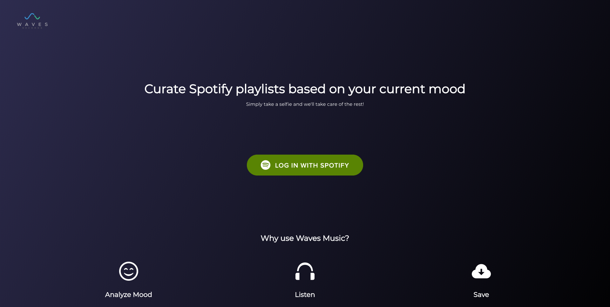

# Waves Records - Curate Spotify playlists based on your current mood

Waves Records is a music-based platform aimed to facilitate the music searching process. Simply take a selfie or use an old photo of you which you feel captures your current state of mind, and we'll take care of the rest. Based on your current mood, Waves Records will curate a set of perfect playlists for you through Spotify, allowing you to save or remove any playlists through the app.

### Technologies Used
This project was made with React, Redux, Ruby on Rails, postgreSQL, Spotify's API, Face++ API, Heroku, and Netlify

### Installation
- Fork this repo
- Bundle install
- rails db:migrate
- rails s to start up the server
- Create a new tab in your console to cd into the client
- npm start to start up the client

### Contributing
Bug reports and pull requests are more than welcome

### License
Waves Records is licensed under the MIT License. (http://opensource.org/licenses/MIT)
